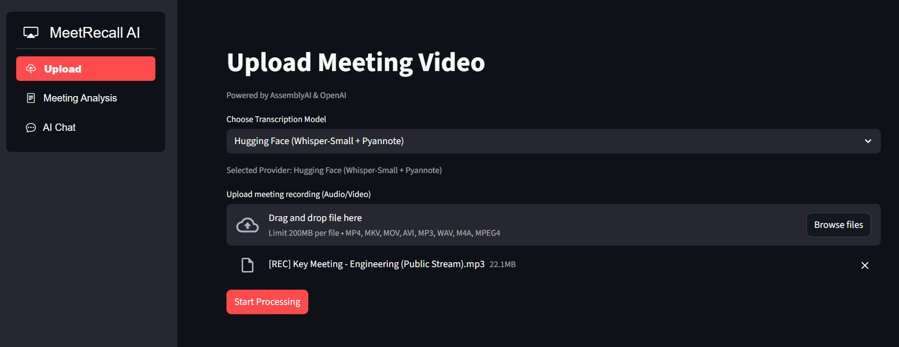
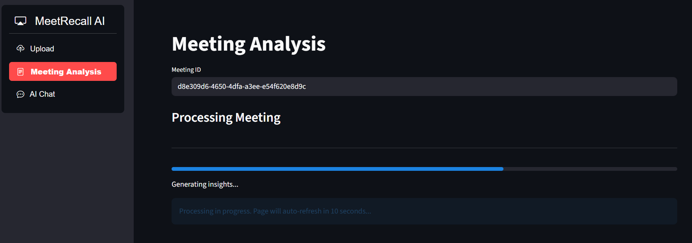
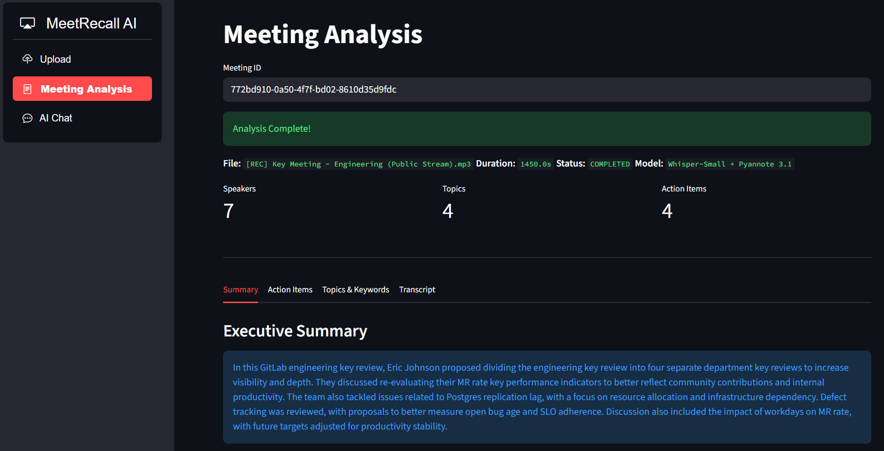
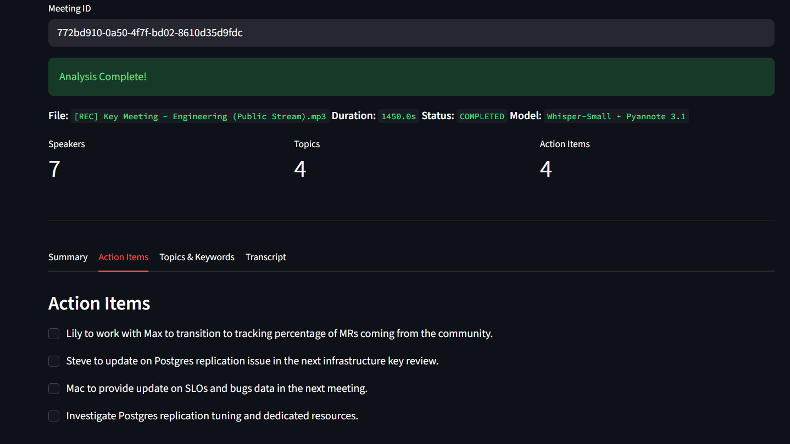
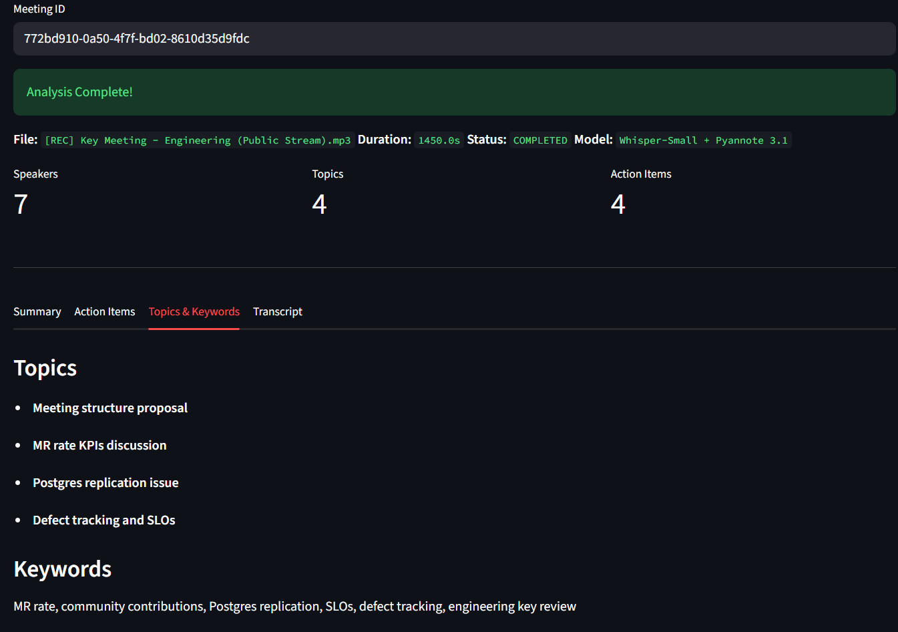
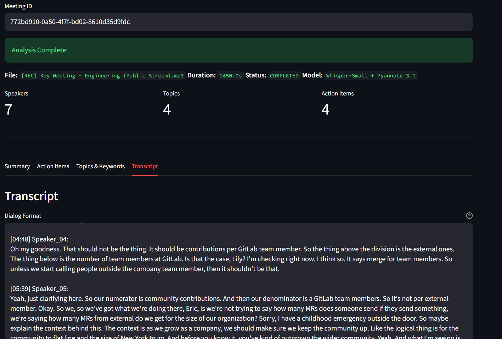
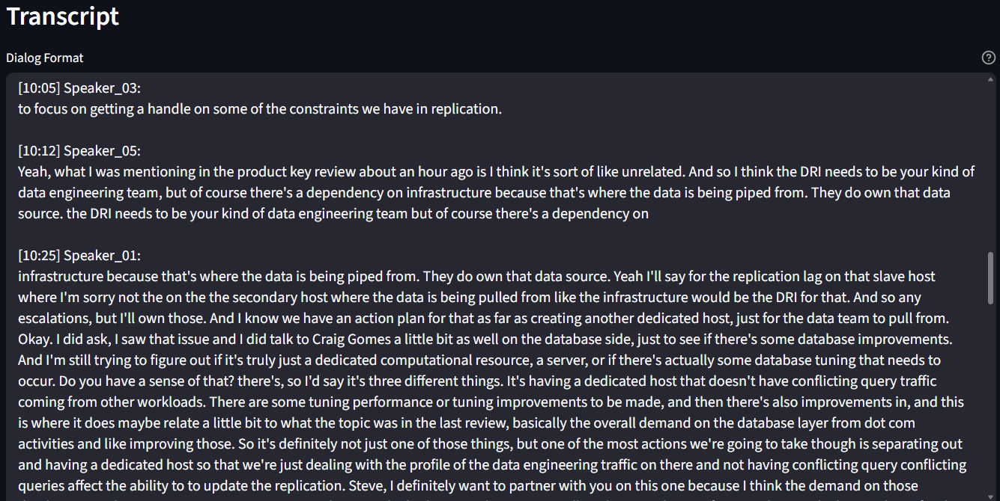
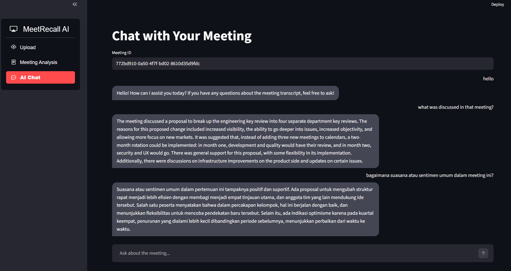

# MeetRecall AI
AI-Powered Meeting Transcription & Intelligent Analysis System

## Overview

MeetRecall AI is an intelligent meeting transcription system designed to automate
speech-to-text processing and extract meaningful insights from recorded meetings.
The system supports both local and cloud-based transcription workflows and is
built with modular AI components to ensure scalability and flexibility.

This project aims to improve documentation efficiency, reduce manual note-taking,
and enable structured meeting analysis.

---

## Application Preview

### Dashboard Interface


### Processing After File Upload


### Meeting Analysis
#### Summary Meeting


#### Action Items


#### Topics & Keywords


#### Transcription Result


### Speaker Diarization Output


### RAG Chatbot 


---

## Key Features

- Automatic Speech-to-Text (Whisper / AssemblyAI support)
- Speaker Diarization (Pyannote Integration)
- Intelligent Transcript Structuring
- Modular Transcription Pipeline
- Local & Cloud Processing Support
- API-based Backend Architecture
- Docker-ready Deployment

---

## System Architecture

MeetRecall AI follows a modular architecture:

1. Audio/Video Upload
2. Audio Extraction (FFmpeg)
3. Transcription Engine
4. Speaker Diarization
5. Post-processing & Formatting
6. Structured Output (JSON / Text)

The architecture is designed for easy model swapping and future LLM-based
analysis integration.

---

## Tech Stack

- Python 3.10+
- FastAPI
- Whisper (Hugging Face)
- Pyannote (Speaker Diarization)
- AssemblyAI API (Optional)
- Docker
- FFmpeg

---

## Demo Video
[Watch Demo](https://drive.google.com/file/d/1u622o6DsRwM1mRU9bg8fJuYlDyRSp3Ga/view?usp=drive_link)

---

## Installation

Clone the repository:

```bash
git clone https://github.com/rilufiyy/meetrecall-ai.git
cd meetrecall-ai
